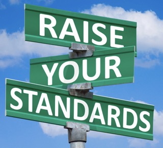

## Coding Standards: Cosmetic or Core Discipline:

Many developers treat coding standards as cosmetic preferences. Tabs versus spaces. Braces on the same line or not. These debates miss the bigger point. Coding standards are about consistency, predictability, and quality control. 
If I could implement only one software engineering technique to improve quality, coding standards would be a strong candidate. Standards reduce ambiguity. When everyone writes code the same way, you can focus on logic instead of deciphering style. That alone improves readability and reduces bugs. 

## ESLint and Immediate Feedback: 

Using ESLint in VSCode feels like having a quiet reviewer watching every line. It highlights potential issues immediately. For example, unused variables often signal incomplete logic: 

const result = calculateTotal(items);

// ESLint warns if result is never used

Without ESLint, that mistake might go unnoticed. After fixing those small errors repeatedly, I noticed that I started to make those errors less frequently. 

## The Not So Hidden Benefit:

Coding standards are not about pleasing ESlint, it instead forced discipline. It made me slow down and write intentional code. They train you to think more carefully. ESLint has helped me understand JavaScript conventions, variable scope, and common mistakes. In that sense, coding standards are not restrictive, they're educational. I now see them as guardrails that make me a better programmer. Coding standards may seem trivial, but they quietly improve clarity, reduce bugs, and teach discipline. In that sense, they are one of the most underrated tools in software engineering.
