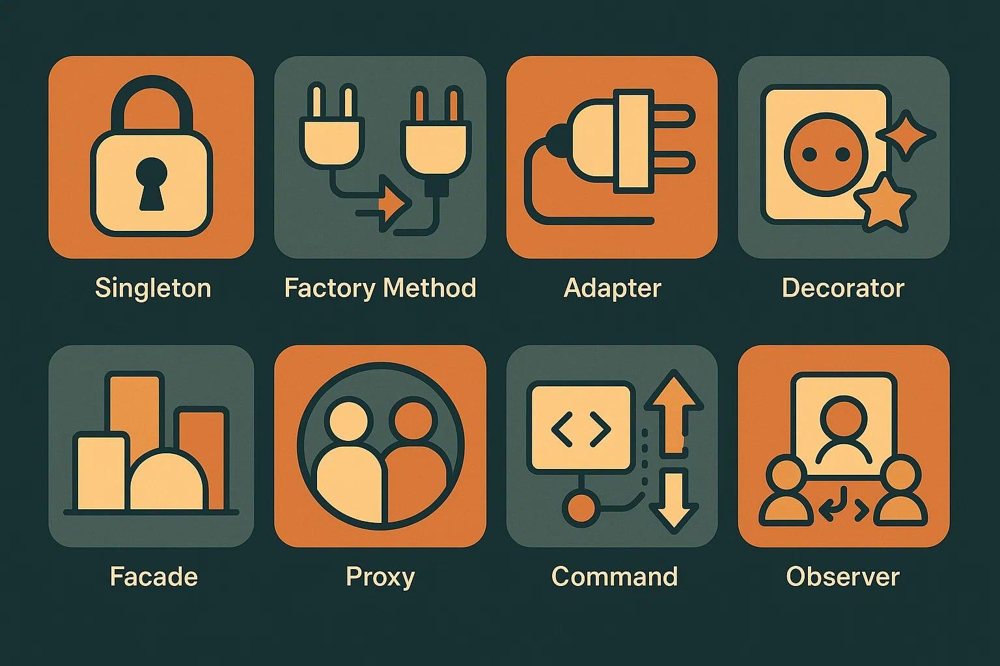

---
layout: essay
type: essay
title: "Design Patterns: The Blueprints Behind Smart Software"
# All dates must be YYYY-MM-DD format!
date: 2026-04-30
published: true
labels:
  - Software Engineering
---

## What Are Design Patterns:

When people hear the phrase design patterns, it can sound more complicated than it really is. Design patterns are not libraries or code that you copy and paste. They are common solutions to common software problems. They are ways developers organize code so programs are easier to build, understand, and maintain.

A good way to think about them is like blueprints in construction. Builders do not redesign doors, stairs, or windows every time they make a building. They use proven designs that already work. Software engineers do the same thing with design patterns.

Patterns help save time, reduce confusion, and make code cleaner. Instead of solving the same structural problems over and over again, developers can use solutions that are already known to work.

## Why They Matter in Interviews:

A common interview question is asking what design patterns are and what patterns you have used. Companies ask this because they want to know if you can do more than just write code.

Anyone can memorize syntax. Design patterns show that you understand how to organize software as projects grow larger. They show that you know how to build code that can be updated and maintained later.

Good programmers write code that works now. Better programmers write code that still works months later.

## Design Patterns in My Final Project:

In my final project, CycleSense, I used several design patterns even if I did not realize it at first.

One example is the Singleton pattern. My Prisma client is created once and reused throughout the application. This helps avoid unnecessary database connections and keeps things organized.

Another example is the Component pattern through React. Things like navbars, forms, cards, and page sections are built as reusable components. Instead of rewriting the same code many times, components can be reused in different places.

My project also uses a Model View Controller style structure. Prisma models handle data, React pages display the interface, and server actions control behavior like signing in users or updating recycling totals.

There is also a Strategy pattern with user roles. The website behaves differently depending on whether the user is an admin or a normal user.

## Final Thoughts:

The biggest lesson I learned is that many developers already use design patterns before knowing their names. They often happen naturally while solving real problems.

Knowing the names still helps because it gives developers a shared vocabulary. It is easier to say Singleton or Component than explain the whole idea every time.

In the end, design patterns are just smart ways to organize software. They help turn code from something that only works today into something that can grow and last.
