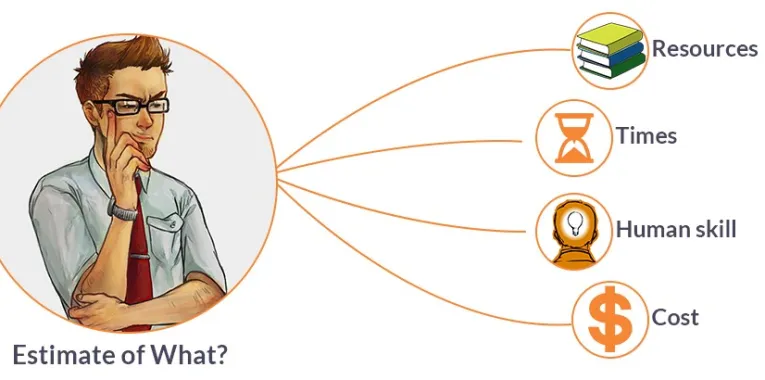

---
layout: essay
type: essay
title: "Effort Estimation and Tracking in Cycle5ense"
# All dates must be YYYY-MM-DD format!
date: 2026-05-11
published: true
labels:
  - Software Engineering
---

## How I Estimated Effort:

During the Cycle5ense project, I worked on features related to the recycling map, profile system, recycling tracking, and admin management pages. Some of the issues I worked on included creating the user profile page, adding password change functionality, improving the admin page, adding recycling entries, and adding recycling pins to the campus map.

Most of my estimates were based on previous assignments and earlier issues from the project. If something looked similar to a feature I already made before, I would usually estimate around the same amount of time. Smaller updates like changing layouts or updating forms were estimated lower because the systems already existed. Larger features involving backend logic, database updates, or testing were estimated much higher.

One issue that took much longer than expected was adding recycling pins to the map. I originally thought it would mostly be coding work, but a large amount of time was actually spent physically walking around campus and checking buildings to find recycling bin locations. That became a major source of non coding effort that I did not fully think about during the original estimate.

## Benefits of Estimating in Advance:

Even though many of my estimates were inaccurate, estimating beforehand was still useful. It helped me understand which issues were probably going to take longer and which ones could be completed quickly.

For example, larger issues like map integration and admin management were started earlier because I already expected they would involve more debugging and testing. Smaller tasks like adding buttons or updating layouts could be pushed later because they were lower risk.

Estimating also helped prevent situations where too many difficult tasks were left unfinished near the deadline. Even if the exact numbers were wrong, having rough estimates still helped with planning.

## Tracking Actual Effort:

Tracking actual effort was useful because it showed me how much time software development really takes outside of just writing code. A lot of time went into debugging, fixing merge conflicts, researching documentation, testing features, and solving unexpected problems.

One thing I noticed was that database related issues usually took longer than expected because changing one thing often affected several other files. Another thing I learned was that debugging sometimes took longer than actually writing the original feature.

Tracking effort also helped me improve later estimates because I started accounting for debugging and testing time instead of only thinking about coding time.

## How I Tracked My Time:

I tracked coding effort mostly by paying attention to how long I was actively coding, debugging, or testing inside VSCode. I used the amount of time spent working directly on the project files as my coding effort.

For non coding effort, I tracked time spent researching, planning layouts, discussing ideas with teammates, using GitHub projects, and physically walking around campus to locate recycling bins for the map system.

I believe my tracking was reasonably accurate overall, although it probably was not perfect. Sometimes coding and non coding tasks blended together, especially when researching solutions while debugging problems.

## What I Would Change Next Time:

If I did this process again, I would break larger issues into smaller tasks before estimating them. Some issues became difficult to estimate because they included frontend work, backend work, database changes, debugging, and testing all together.

Breaking tasks into smaller pieces would probably make estimates more accurate and easier to manage. I would also try to record time more consistently instead of sometimes estimating parts of it afterward.

Another thing I would improve is tracking non coding effort more carefully. Tasks like planning, researching, and physically finding recycling bins took more time than expected and were harder to measure accurately.

## AI Use During Development:

I used ChatGPT by OpenAI with GPT 5 models during development. I mainly used it for debugging help, generating example code, fixing TypeScript or Prisma errors, and helping build pages with Next.js and React Bootstrap.

Some example prompts I used were things like:

- "create a profile page that tracks recycling entries"
- "fix merge conflict in layout.tsx"
- "add admin delete user functionality"
- "why is this prisma relation failing"
- "make this bootstrap layout responsive"

The time spent using AI included writing prompts, testing generated code, debugging issues, and manually editing the generated code so it matched the project structure correctly.

A lot of the AI generated code required manual changes because the responses usually did not perfectly match the database schema, folder structure, or styling already being used in the project. Even so, AI was still very useful because it sped up development and helped solve problems faster than searching documentation alone.
