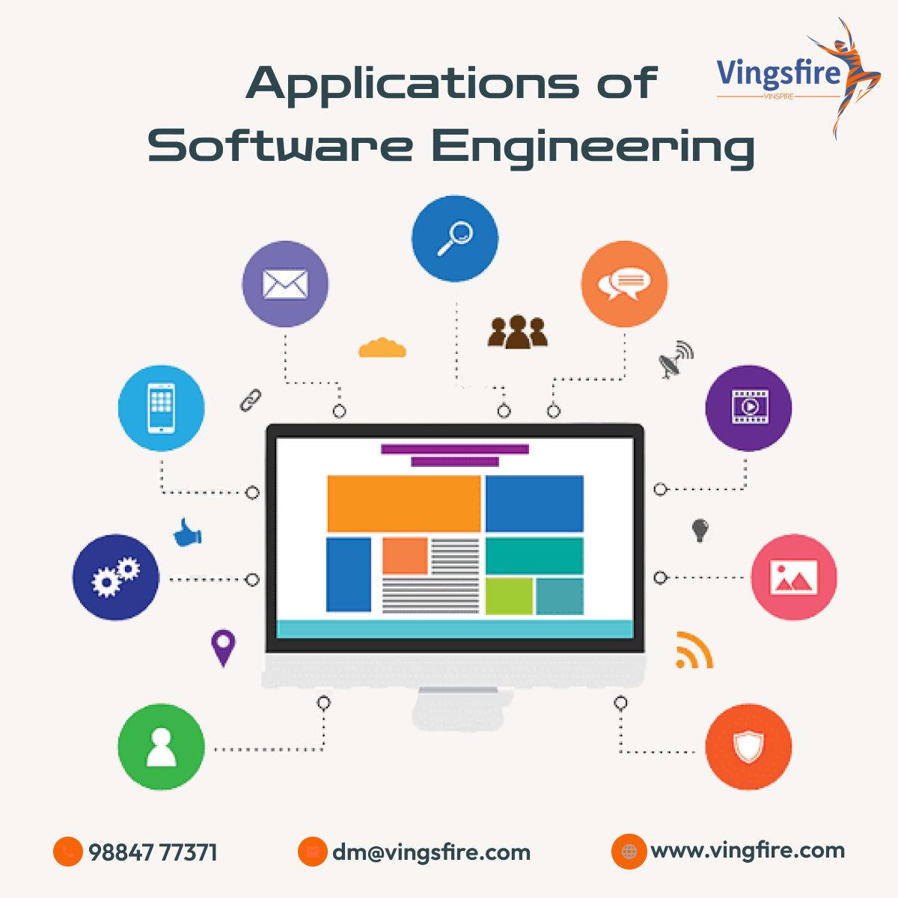

## What I Learned About Software Engineering:

Before taking ICS 314, I mostly thought software engineering just meant writing code that works. After going through the class, I understand that it is bigger than that. Web application development was the main way we practiced, but the ideas apply to many other kinds of software. The three topics that stood out to me the most were functional programming, coding standards, and design patterns.

## Functional Programming:

Functional programming is a way of writing code where functions take in information, do one clear job, and return a result without changing random things outside of the function. One important idea is avoiding side effects. A side effect is when a function changes something outside of itself, like a global variable or an object that other parts of the program are using. At first, this felt a little weird because I was used to writing code step by step and changing variables as I went.

Over time, I started to understand why functional programming is useful. If a function gives the same output every time it gets the same input, it is easier to test and debug. This matters beyond web applications. If I were writing a program to process election data, sports stats, financial records, or anything else, I would still want functions that are predictable and easy to trust. Even if I am not using a fully functional language, I can still use functional programming ideas to make my code cleaner.

## Coding Standards:

Coding standards were another important topic. Coding standards are rules for how code should be written. They include things like spacing, indentation, naming variables, file organization, and avoiding certain bad habits. At first, coding standards can seem like they are only about making code look nice, but they are really about making code easier for people to read and maintain.

In ICS 314, tools like ESLint helped enforce coding standards by pointing out problems right away. This was useful because it caught small mistakes before they became bigger issues. Coding standards matter in any software project, not just web applications. If I were working on a mobile app, game, desktop program, or database project, I would still want the code to be consistent. This is especially important when working with a team because everyone needs to understand each other’s code.

## Design Patterns:

Design patterns were also useful to learn about. A design pattern is a common solution to a common software problem. It is not usually code that you copy and paste directly. It is more like a known way to organize code. One example from the final project was the component pattern in React. Things like navbars, forms, cards, and tables can be built as reusable components instead of rewriting the same code over and over.

Another example was the singleton idea with the Prisma client. A singleton means there is one shared instance of something instead of making a new one every time. This is useful for database connections because too many unnecessary connections can cause problems. Design patterns matter beyond web development because all large software projects need structure. Whether someone is building a game, banking system, school registration system, or web app, they still need organized code that can grow over time.

## Final Thoughts:

Overall, ICS 314 taught me that software engineering is not just about making something work once. It is about writing software that can be understood, tested, fixed, and improved later. Functional programming helped me think about predictable code. Coding standards helped me understand why consistency matters. Design patterns helped me see how common problems can be solved with reusable ideas. These lessons apply beyond web apps, and I think they will be useful in almost any software project I work on in the future.
