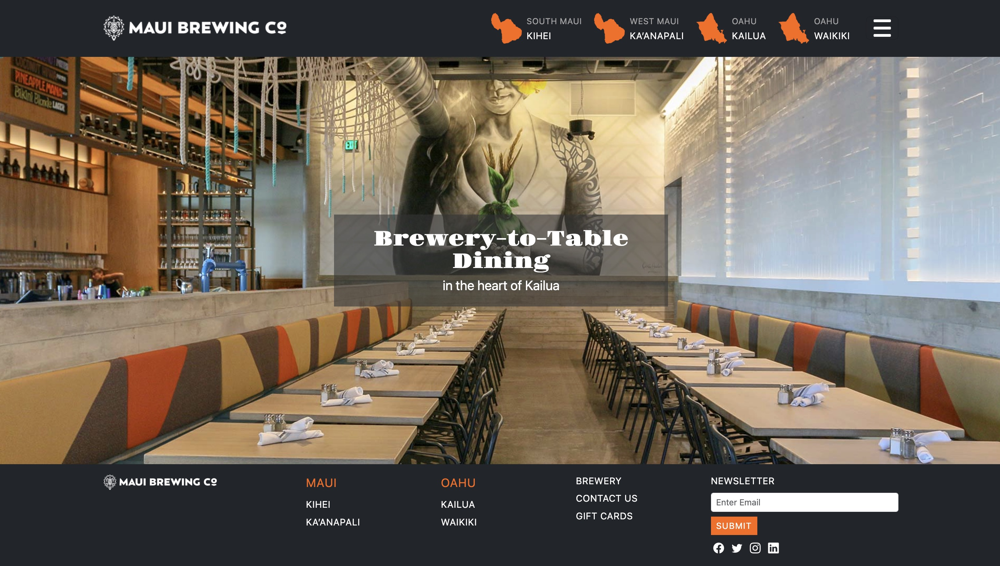

## Why Learn Something So Complicated?
UI frameworks are not simple. Learning Bootstrap 5 can feel almost like learning a new programming language layered on top of HTML and CSS. There are grids, breakpoints, utility classes, and component systems to understand. The leverage it provides over raw HTML and CSS is what makes it beneficial. Bootstrap is not just a styling tool. It is a system. It packages responsive design, spacing logic, and layout structure into reusable patterns. Instead of reinventing layout rules every time, Bootstrap provides a reliable consistent framework.

## Raw CSS vs. Structured Abstraction
Building a responsive layout from scratch is possible, but custom CSS, media queries, and constant testing across screen sizes would be needed. However, with Bootstrap just a small snippet of code handles responsiveness automatically:

```html
<div class="container">
  <div class="row">
    <div class="col-md-8">Main</div>
    <div class="col-md-4">Sidebar</div>
  </div>
</div>
```
Bootstrap hides complexity behind predictable structure.

## A Framework Is a Mental Model
Bootstrap also changes how someone would think about layout. Instead of designing everything from scratch, developers can think in terms of containers, rows, and columns. That structure creates consistency across pages and teams.
From a software engineering perspective, Bootstrap provides standardization, reusable components, faster development, and easier collaboration. Although the learning curve and the frustration is real, once internalized, development becomes faster and cleaner.

## Worth the Investment?
UI frameworks are not about laziness. They are about abstraction and scalability. Bootstrap allows focus on functionality and user experience instead of constantly debugging layout. The time investment upfront pays off in long term maintainability and speed. In the end, Bootstrap is not just a CSS library. It is a framework for building interfaces at scale.


