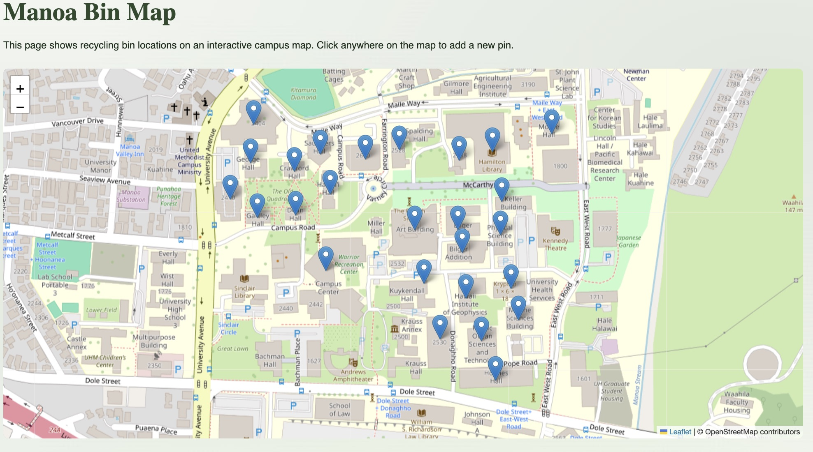

Cycle5ense is a web application created for ICS 314 that helps users find recycling bin locations around the University of Hawaii at Manoa campus. The project was designed to support better recycling habits by making bin locations easier to find and by giving users a way to track how much they recycle.

The application includes an interactive map, a recycling sorting guide, Bottles4College announcements, recycling impact statistics, user profiles, and admin tools. Users can sign up, log in, add recycling entries to their profile, and see their personal recycling total. Their recycling entries also update the overall statistics page. Admin users can manage user accounts, reset passwords, delete profiles, and view user recycling totals.

## My Contributions

My main contributions focused on the interactive map, user profile system, recycling tracking, and admin user management features.

For the map system, I worked on adding recycling bin pins to the Manoa Bin Map. This involved figuring out how to use Leaflet with Next.js, connecting pin data to the application, and making sure the map displayed bin locations correctly. A large part of this work also involved physically walking around campus to find recycling bins in different buildings and record their locations.

For the user system, I worked on creating the profile page where users can update their name, change their password, and add recycling entries. I also helped connect those recycling entries to the recycling statistics page so that the overall totals update when users add or delete recycling data.

For the admin system, I worked on improving the admin page so admins can view all users, reset passwords, and delete user profiles. When a user profile is deleted, that user's recycling entries are also deleted so the statistics page stays accurate.

## What I Learned

This project taught me a lot about how many different pieces have to work together in a real software project. I learned more about Next.js, React components, Prisma, PostgreSQL, authentication, server actions, and interactive maps. I also learned how important it is to keep the database structure organized because small schema changes can affect many parts of the application.

One of the biggest lessons I learned was that building software is not just writing code. A lot of time went into debugging, testing, walking around campus to gather data, fixing merge conflicts, and making sure features worked correctly with the rest of the project. I also learned that admin features need to be handled carefully because deleting users or resetting passwords affects important application data.

Overall, Cycle5ense helped me understand software engineering as more than just web development. It required planning, teamwork, database design, user interface work, debugging, and project management.

## Links

You can view the project source code and organization page here:

[Cycle5ense GitHub Organization](https://github.com/cycle5ense)

You can view the deployed application here:

[Cycle5ense Website](https://cycle5ense.vercel.app/)
